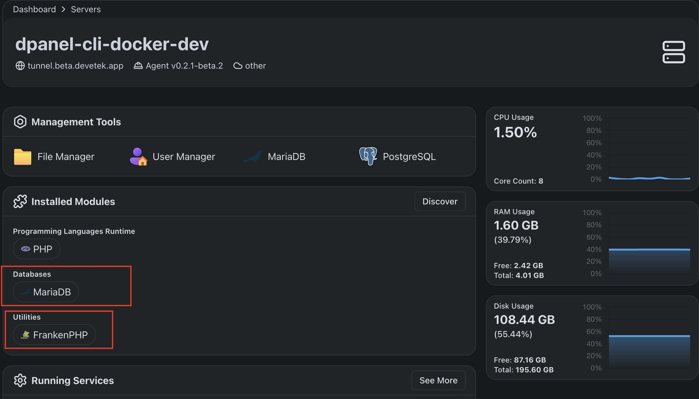
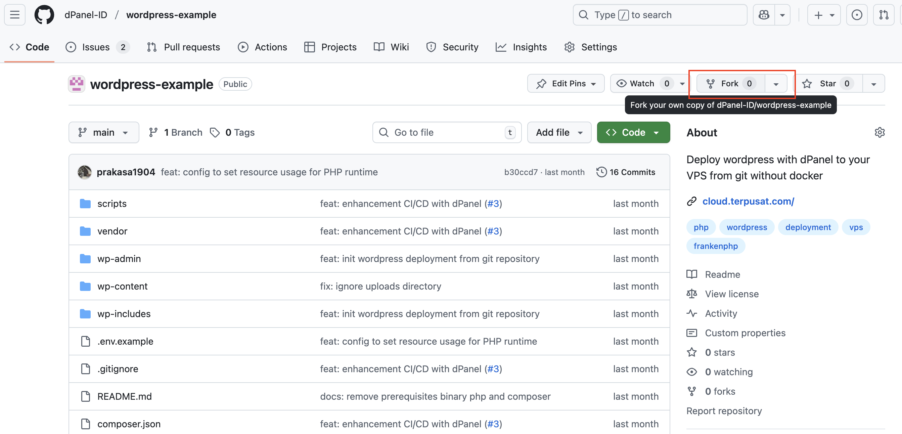
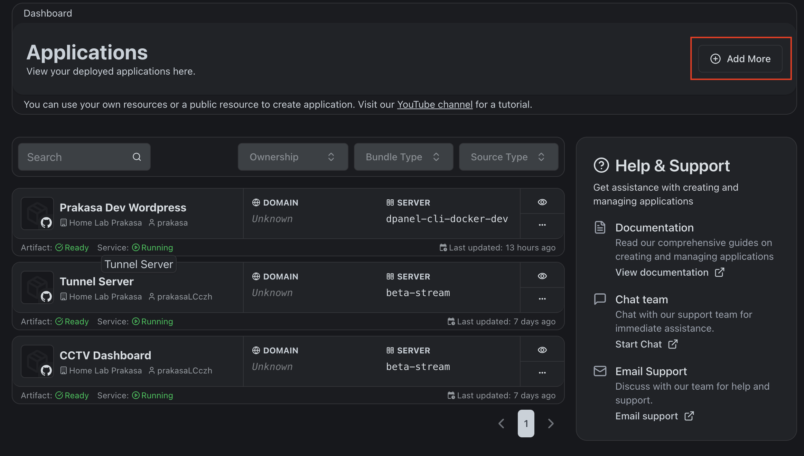
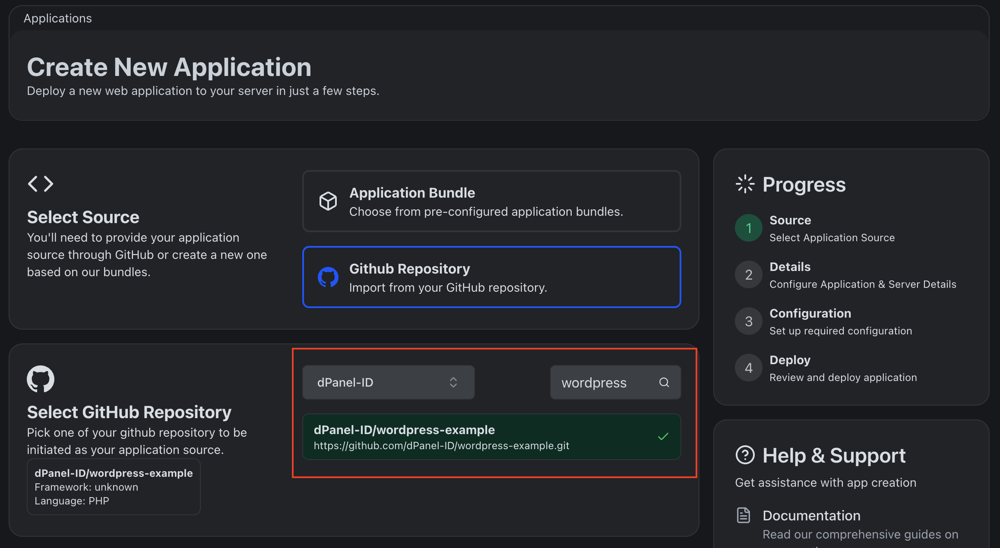
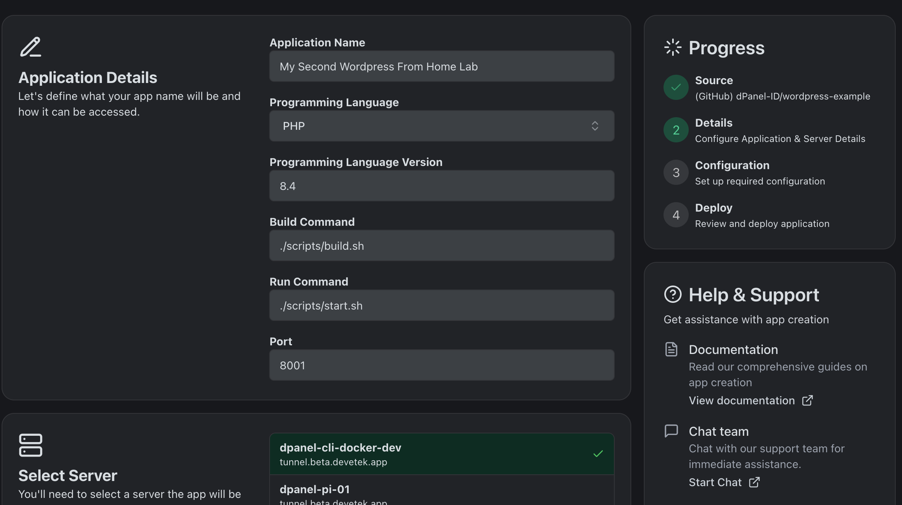
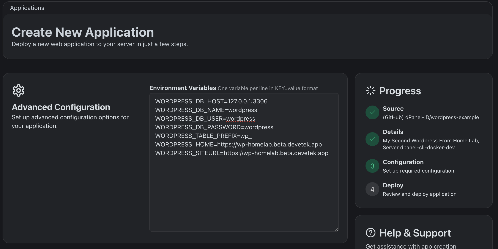
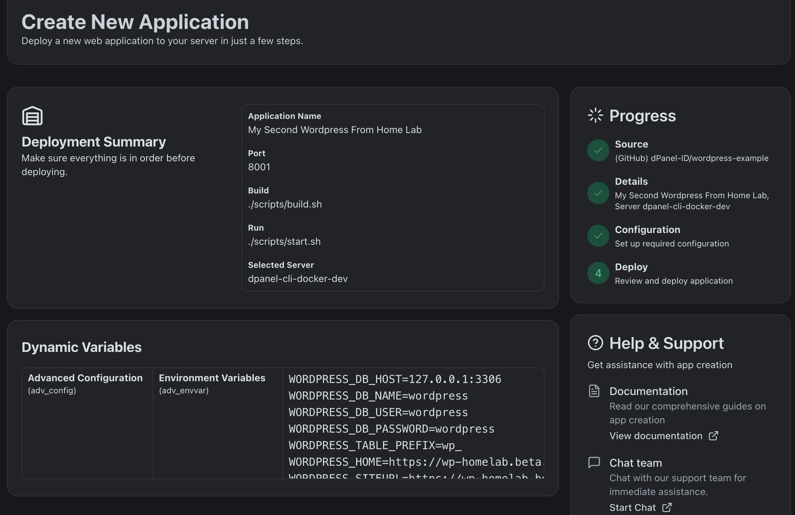

## WordPress Example
Deploy wordpress from github repository through dPanel without docker. The wordpress will running behind load balancer. The load balancer will forward the request to the wordpress server which running in defined port.

### Development

To running in development, some prerequisites are required. You need to have MySQL / MariaDB installed. Or you can use docker to run MariaDB. Here, we provide a docker-compose file to run MySQL. You can run it by executing the following command.

```bash
docker-compose up -d
```

After that, you need to follow the steps below.

1. Copy .env.example to .env, and fill the required environment variables.

2. Execute dev build script.

```bash
./scripts/build-dev.sh
```

3. Start development server.

```bash
./scripts/start-dev.sh
```

4. Access the wordpress site through http://localhost:8081.

### Production

Before you can create wordpress from the repository. You need to make sure 2 thigs:

1. Database and frankenPHP installed in server

2. Fork this repository, so it can be chosen from dPanel

3. You have domain to routing to the wordpress site

If all the prerequisites completed, now you can create new wordpress application using this repository:

1. Create New dPanel Application


2. Select Repository


3. Fill The Application Data


4. Set environment variables


5. Confirmation Before Deployment


